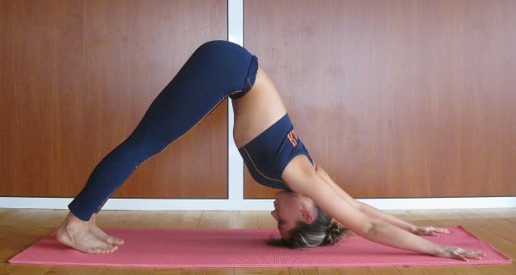
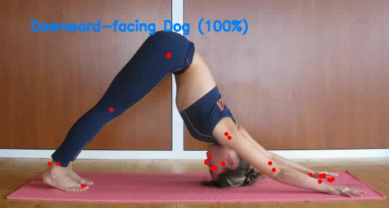
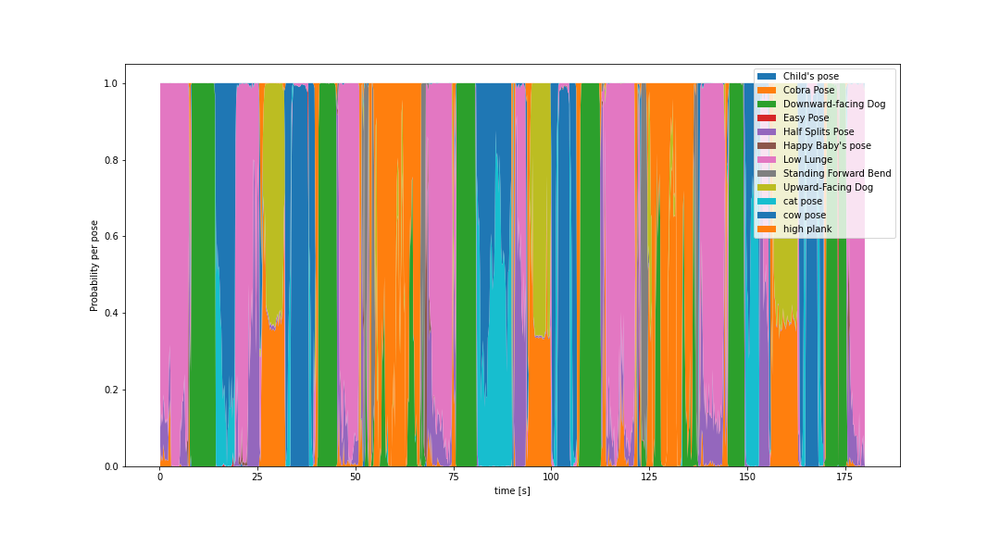
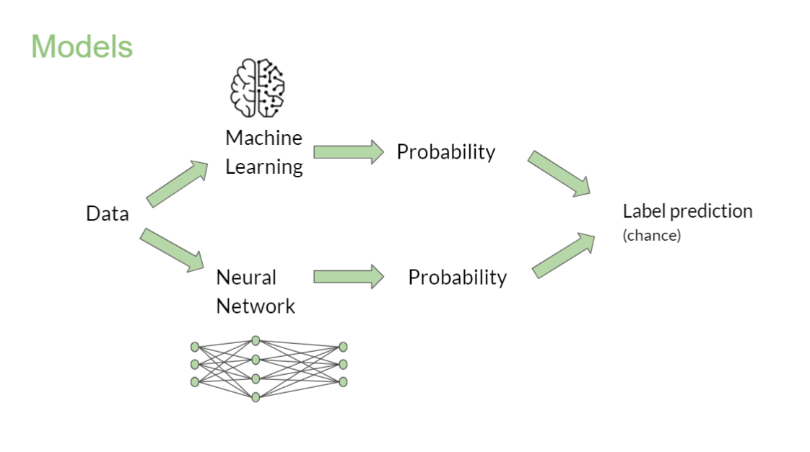

# Yoga class analysis

In this project, we use computer vision to classify yoga poses from video. We use [MediaPipe](https://mediapipe.dev/) for the pose detection, and then machine learning or a neural network to classify the resulting data points to a small selection of yoga poses.


|  |  |
|:-:|:-:|
| Downward-facing dog *(source: Wikipedia)* | Analysis with MediaPipe and our forward-facing model | 

To run a simple **demo** on a video file or with your webcam, run `python demo.py` – provided that you have the needed [prerequisites](requirements.txt) installed. 


## About this project
This project outcome belongs to **Bram De Vroey**, **Joren Vervoort** and **Gülce Padem** who are currently junior Data Scientists/AI Operators in making at BeCode's _Theano 2.27_ promotion.
The project was completed in 1.5 weeks.


### Mission objectives

- Use of computer vision techniques for tracking poses on images and videos.
- Exploration of pre-trained models for pose tracking on live and streaming media.
- Deployment of models for end-customers.

### The Mission

The client is a wellbeing company based in NY city. They are currently providing yoga sessions online with trainers connected in real-time. This system allows the company to reach more people, facilitates the agenda of the clients, and increases the engagement on the sessions since the coaches are available to help.

Now, the job is becoming challenging for the coaches because it's hard for them to keep track of the progress of each one of the participants. They would like to evaluate if the people are doing correctly the poses and provide custom-made training plans but it's hard to do when hundreds are joining the same class.

Would you like to travel to NY? The company is asking for an AI developer with the skills to build an application able to track the poses done by the yoga practitioner, measure time, repetitions and evaluate if the poses are done correctly.

The company envisions an MVP where the customers receive a report of the yoga poses, which ones were done correctly, and metrics related to time and repetition. 


## Installation & Use

All necessary packages are in [requirements.txt](requirements.txt), it's best best make a virtual environment and install with 
```python 
pip install -r requirements.txt
```

To *use* the processing pipeline, you run **video_processing.py**, however this is very basic and not very well-tested.

```
python video_processing.py VIDEOFILE [rf|nn]
```

The main part is the function `process_video()` in _video_processing.py_, which can be used to convert a video to an annoted one, and also returns a dataframe with probability distribution of all poses for each analyzed frame. For all options, look in the docstrings of the Python files.

## Workflow


The yoga pose detection is done in two big steps: 
* **Body pose detection** with MediaPipe;
* **Pose classification** with machine learning or neural networks.

To go from the body part positions to person and camera-independant representation, we calculate angles between imporant body parts, like *shoulder → elbow ← wrist*.

Also a dataframe with to probability distirubtion at each point in time is returned and can then be used to do some **workout analysis**, like pose repetition/duration etc.




## Important files in this repository
- **data_collection**:
    - [Data_extraction.ipynb](data_collection/Data_extraction.ipynb): How to extract bodypoints from images
    - [Extra_Data.ipynb](data_collection/Extra_Data.ipynb): Scraping extra data and extracting the bodypoints

- **dataset**:
    - [full_data.csv](dataset/full_data.csv): file containing all the body angles and labels

- **exploration**:
    - [video.py](exploration/video.py): How to use detection on video files
    - [webcam.py](exploration/webcam.py): How to use detection on live webcam feed

- **images**: folder containing images that are used in the README.md

- **saved_models**:
    - [NN_model](saved_models/NN_model): A folder containing the saved Neural Network
    - [model.sav](saved_models/model.sav): A file containing the saved machine learning model
    
- Usage scripts 
    - [README.md](README.md)
    - [requirements.txt](requirements.txt)
- Preprocessing
    - [preprocessing.py](preprocessing.py): A file containing the preprocesssing of images
- Model training:
    - [NN_classifier.ipynb](NN_classifier.ipynb): Training and saving the NN model
    - [RandomForest_model.py](RandomForest_model.py): Training and saving the machine learning model
- Demo:
    - [demo.py](demo.py): Demo of yoga pose recognition using video files or live webcam feed


## data_collection
**Data_extraction.ipynb**: 
In this jupyter notebook landmarks can be extracted (f.e.: nose, right_heel, left_hip, etc.) from given images of yoga poses from within the dataset. The XYZ coordinates and label of the yoga move are then stored in output.csv.

**Extra Data.ipynb**: 
To extend the trainingset for the models, extra images containing other people performing the yoga move, different camera angles had to be added. In this jupyter notebook extra images of the yoga poses can be automaticly downloaded. After this download, the images have to be checked for correctness by hand to ensure the right yoga move is performed within these pictures. Then the landmarks are extracted and added combined with output.csv into a new .csv file called full_data.csv.

## dataset
**full_data.csv**: 
A .csv file containing the XYZ coordinates and labels of the performed yoga moves on the images in the dataset.

## exploration
**video.py**: 
Exploration file that overlays a prerecorded video with bodypoints using the MediaPipe and opencv libraries. It predicts the yoga move based on the saved machine learning model (RandomForestClassifier). This predicted yoga move is then displayed on the video with its probability.

**webcam.py**: 
Exploration file that overlays live webcam feed with bodypoints using the MediaPipe and opencv libraries. It predicts the yoga move based on the saved machine learning model (RandomForestClassifier). This predicted yoga move is then displayed on the live webcam feed with its probability.

## Preprocessing
**preprocessing.py**: 
This file contains all functions to load images and extracts the bodypoints using MediaPipe library returning them as XYZ coordinates. A function to calculate the 3D body angles to make the pose independent from a coordinate system and label them.

## Model training



### Machine Learning
**RandomForest_model.py**: 
In this file a multiclass classifier (random forest) is trained and evalutated to label the 12 different yoga moves. First the training data is split into a training, testing and validation set. After the training of the model, a confusion matrix, classification report and accurracy score are generated for the training-test set and the training-validation set. After this the model is saved to model.sav.

### Neural Network
**NN_classifier.ipynb**: 
This notebook contains the training and saving of the Feedforwad Neural Network to label the 12 different yoga moves. First the training data is split into a training, testing and validation set. After the training of the model, a confusion matrix, classification report and accurracy score are generated for the training-test set and the training-validation set. After this the model is saved to the folder NN_model.

## Demo
**demo.py**: 
An interactive file that will predict the yoga moves displayed on a videofile or live webcam feed, depending on the model you select.

## Pending things to do

There is potential for this technology. In only one week time we can get basic results. So given more time and data this project could be optimized by:
- Involving a yoga expert for better data selection
- More training data
- Fine tuning of the models
- Fine tuning of the MediaPipe library (because it does not always detect the body points accurate)


# THANK YOU FOR READING!

